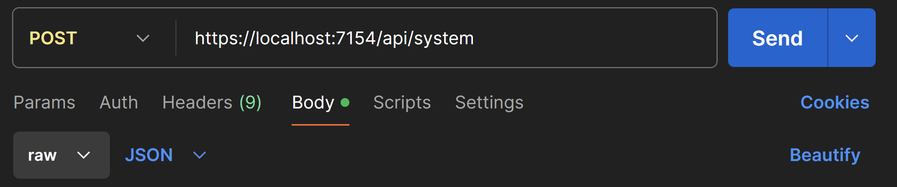
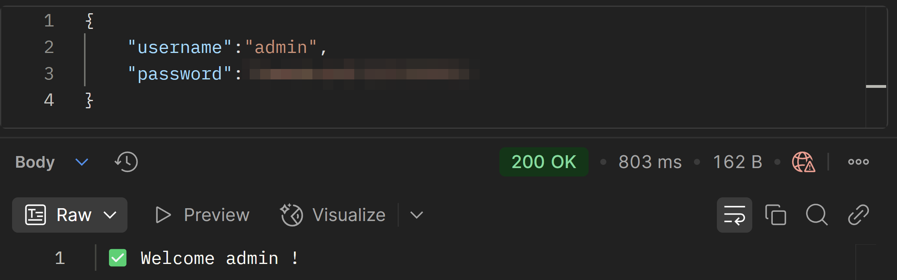
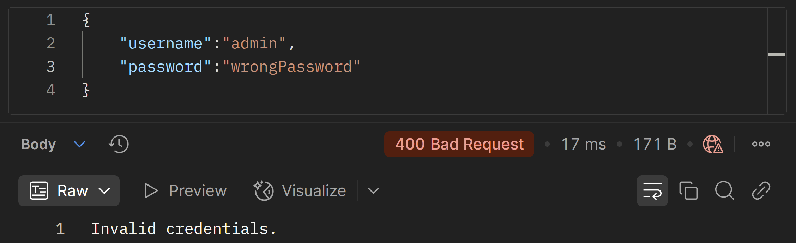
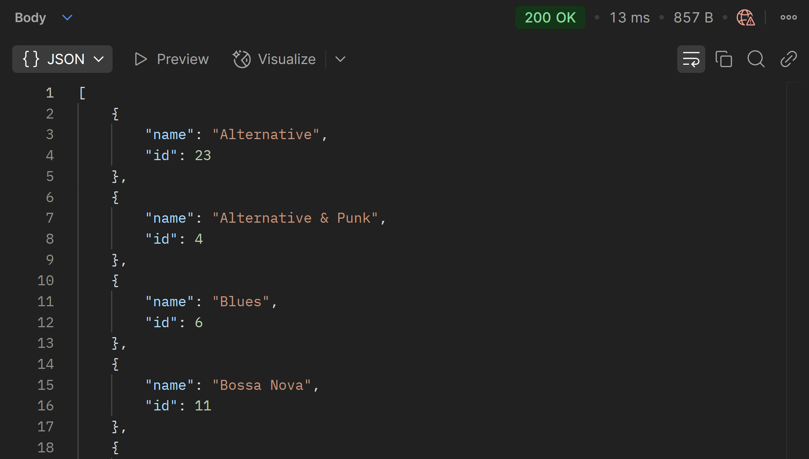
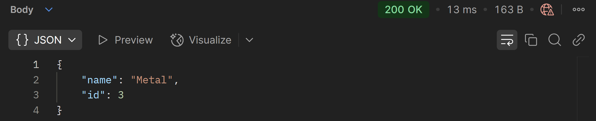
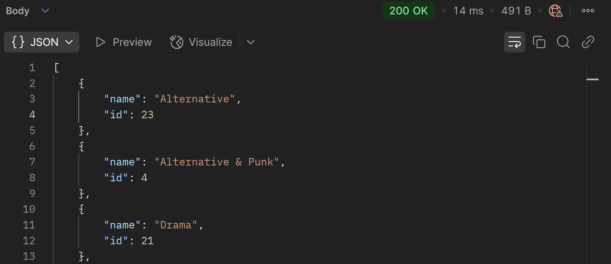

###### 
 PoseUebung-021 

  # Music Store 
  ### *with MSSQL Database & ASP.NET Web API ( + generic Controller )*

>[!NOTE]
> 

>  
>  Please read [***this document***](https://github.com/IxI-Enki/PoseUebung-021/tree/master/MusicStore.Logic/Connections) if you fork the repository.
>
> 

 
---

- ## 1.) Database

---

- ## 2.) Web API

  - ### *System-Controller* : 

  

  
    |    ***Testing with Postman***                               |
    |:-----------------------------------------------------------:|
    |  | 
  
    |    *Valid* Login                                          |                      *Invalid* Login                      |
    |:---------------------------------------------------------:|:---------------------------------------------------------:|
    |  |  |
  
  

    ---

  - ### *Genre-Controller* : 

    - #### *GET* :
    
      

      |  | 
      |:-----------------------------------------------------------:|

      | ***ALL*** |
      |:-----------------------------------------------------------|
      |  | 
      |  | 

      | *by* ***ID*** |
      |:-----------------------------------------------------------|
      |  | 
      |  | 

      | *by* ***Query*** |
      |:-----------------------------------------------------------|
      |  | 
      |  | 

      

         ---
  
