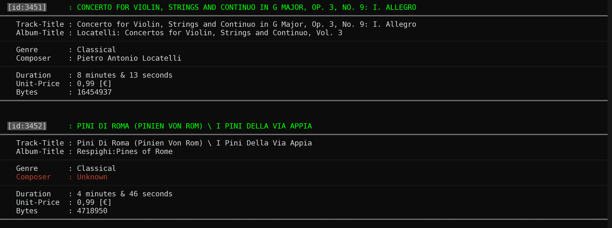
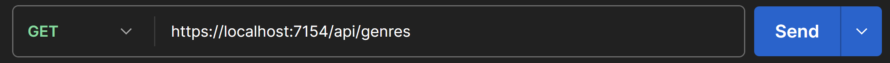
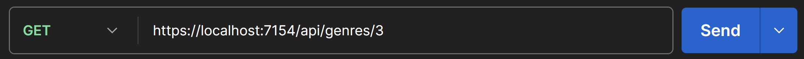
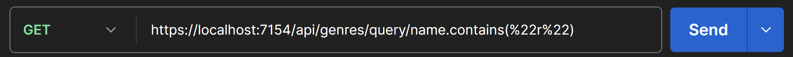

###### 
 PoseUebung-021 

 
  
   
  

  # Music Store 
  ### *with MSSQL Database & ASP.NET Web API ( + generic Controller )*

>[!NOTE]
> 

>  
>  Please read [***this document***](https://github.com/IxI-Enki/PoseUebung-021/tree/master/MusicStore.Logic/Connections) if you fork the repository.
>
> 

 
---

## 1.) Console Application

  

   |  | 
   |:----------------------------------------------------------------:|

 

---

## 2.) Web API

  - ### *System-Controller* : 

    

  
    |    ***Testing with Postman***                               |
    |:-----------------------------------------------------------:|
    |  | 
  
    |    *Valid* Login                                          |                      *Invalid* Login                      |
    |:---------------------------------------------------------:|:---------------------------------------------------------:|
    |  |  |
  
    

    ---

  - ### *Genre-Controller* : 

    - #### *GET* :
    
      

      |  | 
      |:-----------------------------------------------------------:|

      | ***ALL*** |
      |:-----------------------------------------------------------|
      |  | 
      |  | 

      | *by* ***ID*** |
      |:-----------------------------------------------------------|
      |  | 
      |  | 

      | *by* ***Query*** |
      |:-----------------------------------------------------------|
      |  | 
      |  | 

      

         ---

  
  $$\Huge\color{orange}{subject \quad to \quad change \quad - \quad work \quad in \quad progress \quad !}$$
---  

  
  >  
  >  
  >  
     
   - #### *POST* :
    
      

      
      

        ---

   - #### *PUT* :
    
      

      
      

        ---

   - #### *PATCH* :
    
      

      
      

        ---

   - #### *DELETE* :
    
      

      
      

---
 
  - ### *Artist-Controller* : 

<!--

    - #### *GET* :

      

      |  | 
      |:-----------------------------------------------------------:|
    
   | ***ALL*** |
   |:-----------------------------------------------------------|
     |  | 
     |  | 

   | *by* ***ID*** |
   |:-----------------------------------------------------------|
      |  | 
      |  | 

   | *by* ***Query*** |
   |:-----------------------------------------------------------|
  |  | 
  |  | 

      

-->

---
