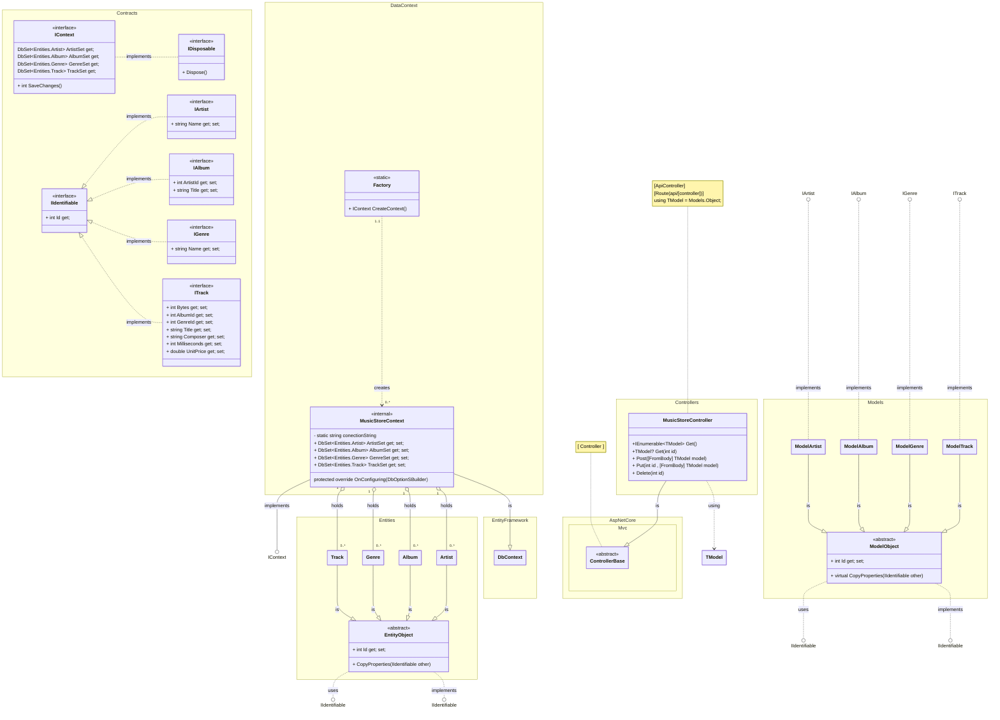

### 
 Music Store with REST API 

---

<!--

  | `classA` |"| card.A |"| `Rel.Type` | `Link` | `Rel.Type` |"| card.B |"| `classB` | : | `LabelText` |  
  |:--------:|-|:------:|-|:----------:|:------:|:----------:|-|:------:|-|:--------:|:-:|:-----------:|

  

  $\scriptsize{click\ for\ more\ syntax}$
  `Relation Type`
  

  | [*Relation Types*] |${\quad\ \ }$| [*Link Types*] |
  |:------------------:|-------|:--------------:|

  |  Type  |  Description  |${\ }$|  Type  |  Description  |
  |:------:|:-------------:|------|:------:|:-------------:|
  |   <\|  |  Inheritance  |${\ }$|   --   |     Solid     |
  |   \*   |  Composition  |${\ }$|   ..   |     Dashed    |
  |   o	   |  Aggregation  |${\ }$|        |               |
  |   ->   |  Association  |${\ }$|        |               |
  |  <-	   |  Association  |${\ }$|        |               |
  |  \|>   |  Realization  |${\ }$|        |               |

  

-->

